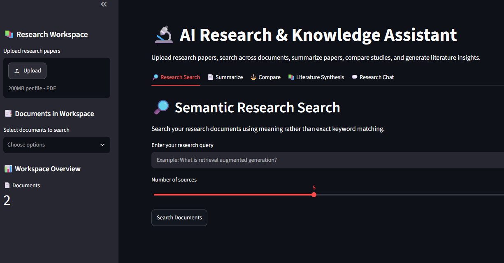
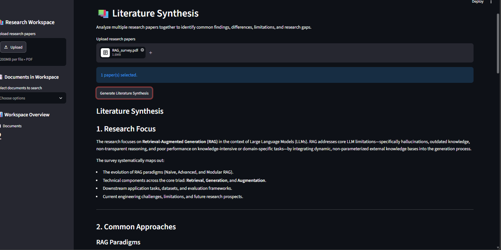
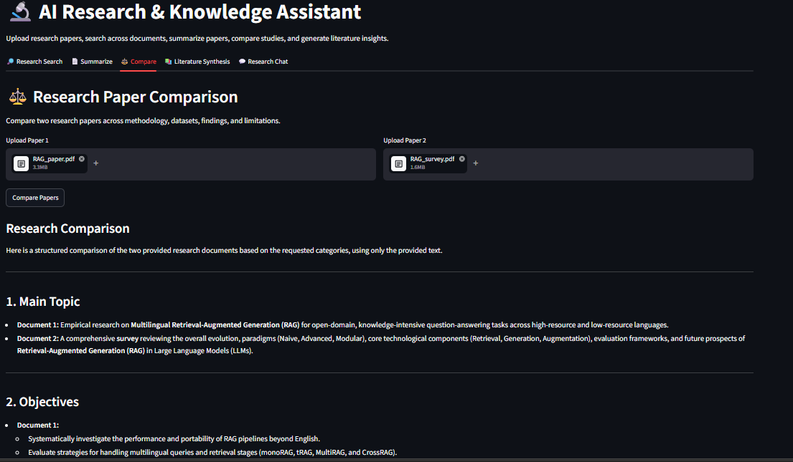

# 🔬 AI Research & Knowledge Assistant

[](https://ai-research-knowledge-assistant-inbtmekvmevnaf9jpfrluy.streamlit.app/)

An AI-powered research assistant that helps users analyze and interact with research papers using **Retrieval-Augmented Generation (RAG)**, semantic search, embeddings, vector databases, and Google Gemini.

Users can upload research papers in PDF format, search across documents, ask research questions, generate summaries, compare papers, and perform literature synthesis through an interactive Streamlit interface.
|
---

## 📸 Application Screenshots

| Main Dashboard & Search | Paper Synthesis & Summarization |
| :---: | :---: |
|  |  |

| Multi-Paper Comparison |
| :---: |
|  |

---
---

## 🚀 Features

### 🔎 Semantic Research Search

Search across uploaded research papers using **semantic similarity** rather than relying only on exact keyword matching.

### 💬 Research Chat

Ask questions about the uploaded research papers and receive AI-generated answers based on relevant document content.

The system also displays the sources used to generate the answer.

### 📄 Document Summarization

Upload a research paper and generate a structured AI-powered summary of its content.

### ⚖️ Research Paper Comparison

Compare two research papers across important research aspects such as:

* Methodology
* Datasets
* Findings
* Limitations

### 📚 Literature Synthesis

Analyze multiple research papers together to identify:

* Common findings
* Differences
* Limitations
* Research gaps

---

## 🧠 How the System Works

The application follows a Retrieval-Augmented Generation (RAG) workflow.

```text
                 Research Papers (PDF)
                          │
                          ▼
                 Document Ingestion
                          │
                          ▼
                  Text Extraction
                          │
                          ▼
                    Text Chunking
                          │
                          ▼
                     Embeddings
                          │
                          ▼
                 Chroma Vector Store
                          │
                          ▼
                    User Query
                          │
                          ▼
                 Semantic Retrieval
                          │
                          ▼
                Relevant Document Chunks
                          │
                          ▼
                  Google Gemini LLM
                          │
                          ▼
                    AI Response
```

For research questions, the system retrieves relevant information from the uploaded documents before sending the context to the language model. This helps generate answers grounded in the user's research documents.

---

## 🛠️ Technologies Used

| Technology            | Purpose                               |
| --------------------- | ------------------------------------- |
| Python                | Application development               |
| Streamlit             | Interactive web interface             |
| PyMuPDF               | PDF text extraction                   |
| Sentence Transformers | Text embeddings                       |
| ChromaDB              | Vector database and similarity search |
| Google Gemini         | AI-powered generation                 |
| python-dotenv         | Environment variable management       |
| RAG                   | Grounded research question answering  |

---

## 📁 Project Structure

```text
AI Research Knowledge Assistant/
│
├── chroma_db/
│
├── data/
│
├── src/
│   ├── document_comparator.py
│   ├── document_ingestion.py
│   ├── document_processor.py
│   ├── embedding.py
│   ├── gemini_client.py
│   ├── literature_synthesizer.py
│   ├── rag_generator.py
│   ├── research_assistant.py
│   ├── retriever.py
│   ├── summarizer.py
│   ├── text_chunker.py
│   └── vector_store.py
│
├── venv/
├── .env
├── .gitignore
├── app.py
└── requirements.txt
```

### Important

The following files/folders are used locally but should **not** be uploaded to GitHub:

```text
.env
Venv/
Chroma_db/
```

They are already excluded through `.gitignore`.

---

## ⚙️ Installation

### 1. Clone the repository

```bash
git clone <your-github-repository-url>
cd AI-Research-Knowledge-Assistant
```

### 2. Create a virtual environment

```bash
python -m venv venv
```

### 3. Activate the virtual environment

**Windows:**

```bash
venv\Scripts\activate
```

### 4. Install dependencies

```bash
pip install -r requirements.txt
```

---

## 🔑 Environment Setup

Create a `.env` file in the project root directory.

Add your Google Gemini API key:

```text
GEMINI_API_KEY=your_api_key_here
```

Keep your API key private and never upload the `.env` file to GitHub.

---

## ▶️ Run the Application

From the project root directory, run:

```bash
streamlit run app.py
```

The Streamlit application will open in your browser.

---

## 🖥️ Application Workflow

### 1. Upload Research Papers

Upload one or more PDF research papers through the sidebar.

The documents are processed and stored for semantic retrieval.

### 2. Search Documents

Enter a research query in the **Research Search** tab.

The system retrieves the most relevant document sections based on semantic similarity.

### 3. Ask Research Questions

Use **Research Chat** to ask questions about the uploaded research papers.

The system:

```text
Question
   ↓
Semantic Retrieval
   ↓
Relevant Document Chunks
   ↓
Gemini
   ↓
Answer + Sources
```

### 4. Summarize a Paper

Upload a PDF in the **Summarize** tab and generate an AI-powered research summary.

### 5. Compare Papers

Upload two research papers in the **Compare** tab to analyze their similarities and differences.

### 6. Synthesize Literature

Upload multiple papers in the **Literature Synthesis** tab to generate insights across the research literature.

---

## 🔍 Core RAG Pipeline

The research question-answering pipeline consists of:

1. **Document ingestion**
2. **PDF text extraction**
3. **Text processing**
4. **Text chunking**
5. **Embedding generation**
6. **Vector storage**
7. **Semantic retrieval**
8. **Context construction**
9. **Gemini response generation**

This architecture allows the application to retrieve relevant information from research documents before generating an answer.

---

## 📌 Key GenAI Concepts Demonstrated

This project demonstrates practical implementation of:

* Large Language Models (LLMs)
* Retrieval-Augmented Generation (RAG)
* Embeddings
* Vector databases
* Semantic search
* Prompt-based generation
* Document processing
* AI-powered summarization
* Multi-document analysis
* Literature synthesis
* Source-grounded question answering

---

## 🎯 Project Objective

The goal of this project is to build a practical AI research assistant that reduces the effort required to search, understand, summarize, compare, and synthesize information from research papers.

---

## 👩‍💻 Author

**Vishnupriya**

B.Tech – Computer Science Engineering

---

## 📄 License

This project is created for educational, portfolio, and demonstration purposes.
